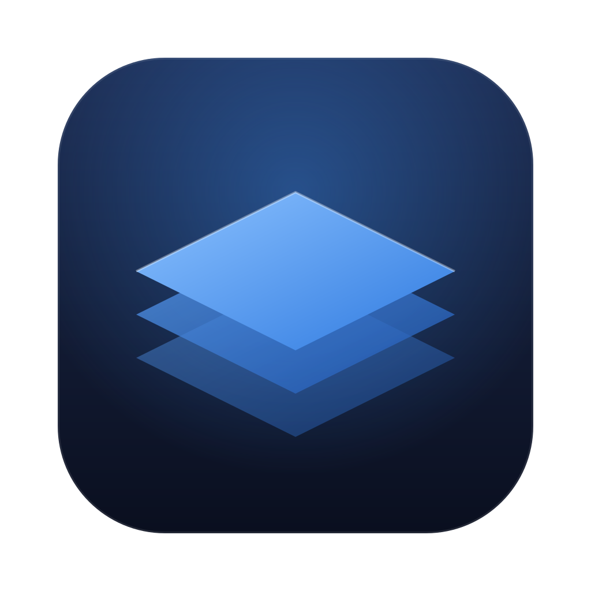

<div align="center">



# KubeStacks docs

The documentation for [KubeStacks](https://github.com/KubeStacks/KubeStacks), a calm, fast
Kubernetes app for your desktop and your cluster. Built with [Mintlify](https://mintlify.com).

</div>

## Running it locally

You need Node.js 20 or later.

```sh
npx mint dev         # http://localhost:3000
npx mint validate    # fails on any build warning or error
npx mint broken-links
```

## How it's organized

| Folder                | What's there                                                      |
| --------------------- | ----------------------------------------------------------------- |
| `get-started/`        | Installing the desktop app or the chart, the tour, signing in     |
| `clusters/`           | Kubeconfigs, namespaces, and the permissions each feature needs   |
| `explore/`            | The overview, lists, the detail panel, health and finding things  |
| `changes/`            | Actions, YAML, creating objects, bulk changes and the guard rails |
| `debug/`              | Logs, shells, debug containers and port forwards                  |
| `metrics/`            | Live usage and usage history                                      |
| `helm/`               | Helm releases, upgrades, installs and local charts                |
| `custom-resources/`   | Custom resources and views                                        |
| `server/`             | KubeStacks in your cluster: install, sign-in, security, settings  |
| `reference/`          | Shortcuts, settings, kinds, troubleshooting, FAQ                  |
| `docs.json`           | Navigation, theme and colors                                      |
| `style.css`           | The app's design tokens, key caps, screenshots and status pills   |
| `screenshots.js`      | Swaps in full-size screenshots when one is zoomed                 |

## Writing

- **Screenshots come from the app's repository**, never from here. KubeStacks takes them
  again from its mock clusters (`npm run screenshots`), and the docs link to them through
  jsDelivr, so they're always current:

  ```mdx
  <Frame caption="A short caption.">
    
    
  </Frame>
  ```

  Names and alt text are in the app's
  [`docs/screenshots/screenshots.json`](https://github.com/KubeStacks/KubeStacks/blob/main/docs/screenshots/screenshots.json).

  Pages link the 1440 px files (`-1x.webp`), and `screenshots.js` swaps in the 2880 px,
  lossless ones when a screenshot is zoomed. `loading="lazy"` keeps the browser from
  downloading the theme that isn't showing. Mintlify drops `srcSet` from images, so this
  is how to get both sizes.

- **Write like the app.** Plain, calm, short sentences. Name buttons and menus exactly as the
  app does, in bold. Show keys as `<kbd>⌘</kbd><kbd>K</kbd>`.
- **Health** is shown as the app shows it, with a mark and a label:
  `<span className="ks-status critical">CrashLoopBackOff</span>` (`healthy`, `warning`,
  `critical`, `progressing`, `neutral`).
- **Icons** are [Lucide](https://lucide.dev/icons), as in the app.
- **Desktop and in-cluster differences** go in a `<Note>` that starts with
  **In your cluster:** or **Desktop app only:**.

## License

[Apache License 2.0](https://github.com/KubeStacks/KubeStacks/blob/main/LICENSE), like KubeStacks.
