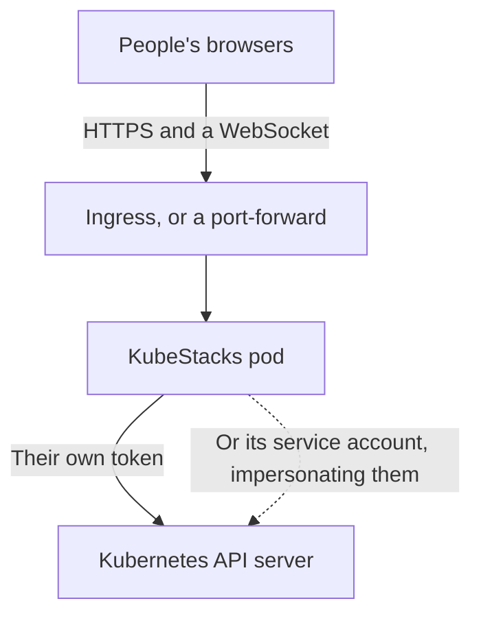

KubeStacks runs in a cluster as a dashboard for that cluster. It's the same app as the desktop one, in a browser: people open its address, sign in, and see and change what their own Kubernetes permissions allow. Nobody installs anything, and a link to any page (a pod, its logs, a Helm release) can be shared.

<Frame caption="KubeStacks served from a cluster, with the menu of who's signed in open.">
  
  
</Frame>

<Columns cols={2}>
  <Card title="Install it" icon="download" href="/server/install">
    One Helm chart, then a port-forward or an ingress. A few minutes.
  </Card>
  <Card title="Joining a team that runs it?" icon="log-in" href="/get-started/sign-in">
    Nothing to install. Here's how signing in works.
  </Card>
</Columns>

## How it works

KubeStacks runs as one pod with a Service in front of it. Each page in a browser keeps one WebSocket open to it, and KubeStacks makes every request to the API server as the person who signed in, so the API server applies their RBAC. KubeStacks never gives anyone more than their own permissions.

It reaches the API server as that person in one of two ways:

- **With their own token.** Their requests carry a token the cluster checks itself. KubeStacks' service account needs no permissions at all.
- **By impersonating them.** KubeStacks sends its service account's credentials with `Impersonate-User` and `Impersonate-Group` headers. The API server checks that the service account may impersonate, then applies the person's RBAC.



Which one depends on how people sign in.

## Ways to sign in

| Sign-in | Who says who people are | KubeStacks' service account needs | Requests reach the cluster |
| --- | --- | --- | --- |
| [Token](/server/auth/tokens) (the default) | The API server, from the token | No permissions | With the person's token |
| [Single sign-on](/server/auth/single-sign-on) | Your OpenID Connect provider | `impersonate` on users and groups | As the service account, impersonating the person |
| [Single sign-on, tokens passed on](/server/auth/single-sign-on#when-the-api-server-trusts-the-provider) | The API server, which trusts your provider | No permissions | With the person's own token |
| [Authenticating proxy](/server/auth/proxy) | The proxy in front of KubeStacks | `impersonate` on users and groups | As the service account, impersonating the person |

When people's own tokens reach the cluster, its audit log names them directly. When KubeStacks impersonates them, the audit log records KubeStacks' service account acting as them. The chart grants the impersonation permission only in the modes that need it.

<Note>
  Signing in with a token needs Kubernetes 1.28 or later: KubeStacks asks the cluster whose token it is with a SelfSubjectReview. Single sign-on and the proxy work from Kubernetes 1.25, like the rest of KubeStacks.
</Note>

## What's different from the desktop app

<AccordionGroup>
  <Accordion title="One cluster" icon="server">
    It shows the cluster it runs in. There's no list of clusters to switch between.
  </Accordion>
  <Accordion title="No port forwarding" icon="plug">
    There's no computer of the user's to forward a port to, so **Forward a port…** isn't offered. See [Port forwarding](/debug/port-forwarding) for the desktop app.
  </Accordion>
  <Accordion title="Charts come from repositories, registries or URLs" icon="package">
    Never from files on anyone's computer. KubeStacks fetches charts only from public addresses unless `helm.allowPrivateCharts` allows private ones, such as a ChartMuseum or Harbor in your network. Otherwise anyone signed in could make it reach services inside the cluster's network. See [Security](/server/security#charts-and-private-networks).
  </Accordion>
  <Accordion title="Preferences belong to each browser" icon="globe">
    The theme, whether the cluster is read-only for you, and where your usage history comes from are kept in your browser. Each person can make KubeStacks read-only for themselves; `readOnly: true` makes it read-only for everyone.
  </Accordion>
  <Accordion title="Upgrading KubeStacks is upgrading the chart" icon="circle-arrow-up">
    The server doesn't update itself. See [Upgrade](/server/upgrade).
  </Accordion>
  <Accordion title="A few shortcuts belong to the browser" icon="command">
    Keyboard shortcuts are the same, except <kbd>⌘</kbd><kbd>N</kbd> and <kbd>⌘</kbd><kbd>1</kbd>…<kbd>⌘</kbd><kbd>6</kbd> (<kbd>Ctrl</kbd> on Windows and Linux), which browsers keep for themselves. The command palette (<kbd>⌘</kbd><kbd>K</kbd>) has those commands. See [Keyboard shortcuts](/reference/keyboard-shortcuts).
  </Accordion>
</AccordionGroup>

## Pages you can share

In a browser, every page has a real address: a list with its filters and sort order, an object's detail panel, a Helm release. Copy the address bar and send it. Whoever opens it signs in, then lands on the same page, seeing what their own permissions allow.

## The image

<div className="ks-facts">
  <div><span className="ks-label">Image</span><span className="ks-value">ghcr.io/kubestacks/kubestacks</span></div>
  <div><span className="ks-label">Platforms</span><span className="ks-value">linux/amd64, linux/arm64</span></div>
  <div><span className="ks-label">Runs as</span><span className="ks-value">Non-root, no shell</span></div>
  <div><span className="ks-label">Writes to</span><span className="ks-value">/tmp only</span></div>
</div>

The image has Node.js, helm and KubeStacks, and nothing else. Each release is signed with a build provenance attestation, which the [GitHub CLI](https://cli.github.com) checks:

```bash
gh attestation verify oci://ghcr.io/kubestacks/kubestacks:{{version}} --repo KubeStacks/KubeStacks
```

The Helm chart is `oci://ghcr.io/kubestacks/charts/kubestacks`. It's released with KubeStacks itself, so the chart's version is the app's.

## Requirements

- **Kubernetes 1.25 or later**, and 1.28 or later to sign in with tokens.
- **Helm**, to install the chart. Helm 3.8 and later read charts from OCI registries.
- **An ingress controller**, if you want KubeStacks at an address of its own. A `kubectl port-forward` is enough to try it.

<Columns cols={2}>
  <Card title="Install it" icon="download" href="/server/install">
    Helm install, open it, sign in.
  </Card>
  <Card title="Security" icon="shield-check" href="/server/security">
    What KubeStacks can do, and how to keep it contained.
  </Card>
</Columns>
